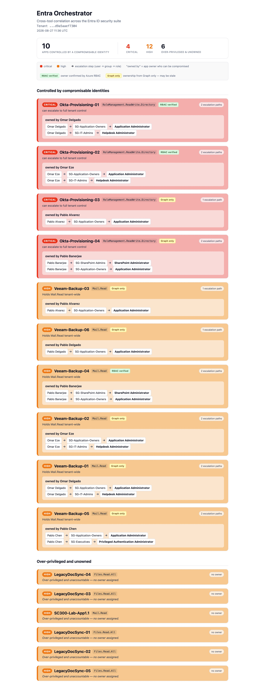

# entra-orchestrator

> ## 🚧 Under Active Development
>
> Core correlation and HTML reporting work. Live scan orchestration (one command to run all three scanners) is next.

Cross-tool correlation for the Entra ID security suite. Reads findings from three independent scanners and surfaces risks that no single tool can see on its own.

## Why

Each scanner in the suite sees one dimension of tenant risk:

- **[entra-workload-identity-scanner](https://github.com/Dfrank77/entra-workload-identity-scanner)** knows which apps hold dangerous permissions.
- **[entra-attack-path-visualizer](https://github.com/Dfrank77/entra-attack-path-visualizer)** knows which users can escalate to privileged roles.
- **[entra-zt-policy-engine](https://github.com/Dfrank77/entra-zt-policy-engine)** knows which Conditional Access controls are missing.

Run separately, each produces its own report. None of them answers the question that actually matters: *is a dangerous app controlled by a compromisable identity?*

The orchestrator answers it by joining findings across tools.

## How

All three scanners write findings in a shared schema ([entra-security-report](https://github.com/Dfrank77/entra-security-report)) to a common store. The orchestrator reads that store and runs two correlations:

**Ownership join** — for every over-privileged application, resolve its owners and check whether any owner is a user the attack-path scanner flags as having a privilege escalation path. Where they match, the dangerous app is owned by a compromisable identity: a real attack chain that neither tool reports alone.

**Ownership confidence** — each correlated finding is tagged with an ownership confidence score based on evidence from both Microsoft Graph and Azure ARM RBAC role assignments. A green **RBAC verified** tag means the registered owner is confirmed by an Azure RBAC role assignment. A yellow **Graph only** tag means ownership comes from Graph alone and may be stale. This surfaces which ownership claims are backed by real Azure access and which ones deserve investigation.

**Over-privileged and unowned** — over-privileged applications with no owner at all. No accountable party, harder to govern, and a standing escalation target. The workload scanner flags the privilege and the missing owner separately; the orchestrator surfaces the dangerous combination.

## Example output

The report renders each correlation as a visual chain — the dangerous app, its risky owner, and the owner's escalation path shown as steps — so the relationship is obvious at a glance.

## Setup

The orchestrator depends on the shared entra_security_report library, a local sibling repo rather than a PyPI package.

    git clone https://github.com/Dfrank77/entra-security-report.git
    git clone https://github.com/Dfrank77/entra-orchestrator.git
    cd entra-orchestrator
    python3 -m venv venv && source venv/bin/activate
    pip install -e ../entra-security-report

On Python 3.14, if the editable install is skipped (a known setuptools .pth issue), point the venv at the source directly instead:

    export PYTHONPATH="/absolute/path/to/entra-security-report/src:$PYTHONPATH"

## Usage

1. Point every tool at one shared findings store:

       export ENTRA_FINDINGS_DIR="$HOME/.entra-findings"

2. Run each of the three scanners (with that variable set) so their findings land in the shared store.

3. Run the correlation and open the report:

       python correlate.py
       open orchestrator_report.html

## Roadmap

- Live orchestration: run all three scanners and correlate from a single command.
- Remediation guidance per finding.
- Additional correlation types (expiring-credential + over-privileged, PIM-eligible ownership).
- Deeper ownership evidence signals (sign-in activity, audit logs, resource metadata).

## Acknowledgments

Ownership confidence scoring was inspired by feedback from [Konrad Zawadka](https://www.linkedin.com/in/konrad-zawadka/) and his [OwnerLensLite](https://github.com/kodevza) approach to evidence-based ownership — treating Graph ownership as one signal among many rather than the single source of truth.

## Author

**Darius Frank** — IAM & Cloud Security

- Portfolio: [dfrank-iam.com](https://dfrank-iam.com)
- GitHub: [@Dfrank77](https://github.com/Dfrank77)
- LinkedIn: [Darius Frank](https://www.linkedin.com/in/darius-frank-24a895192/)
