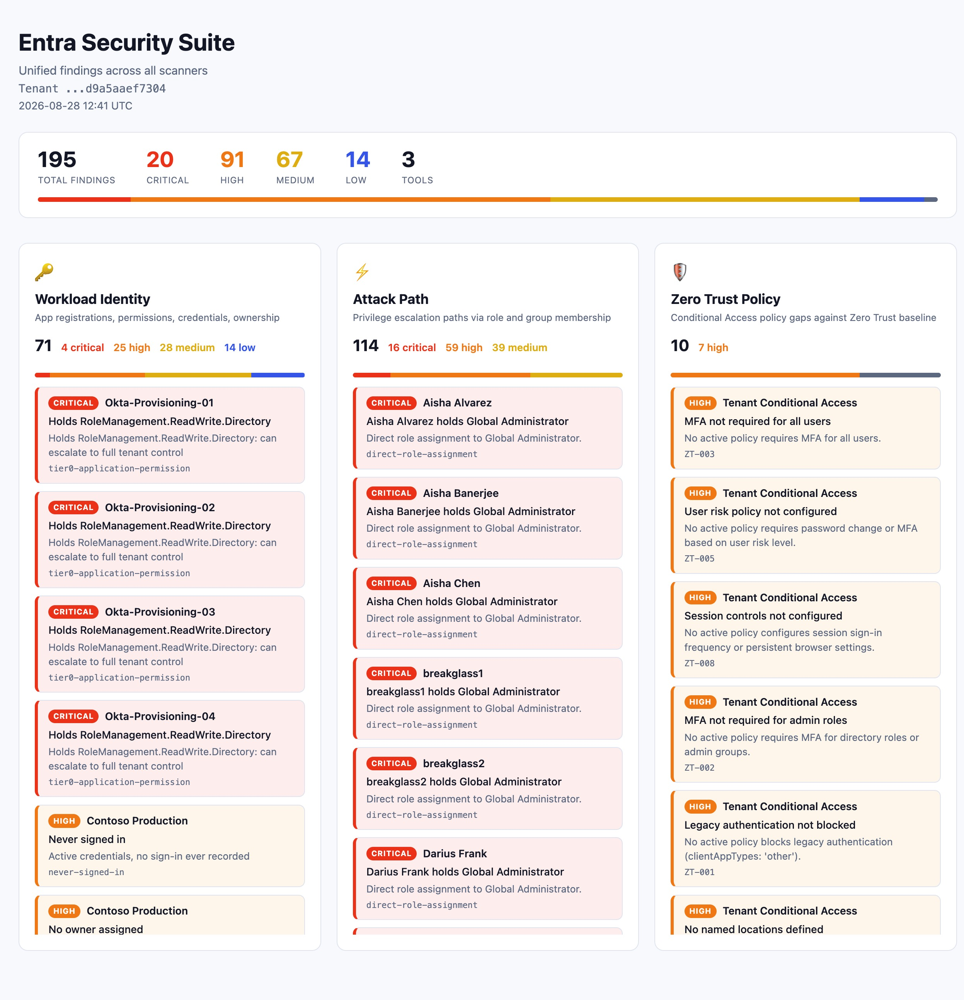

# entra-orchestrator

Cross-tool correlation for the Entra ID security suite. Reads findings from three independent scanners and surfaces risks that no single tool can see on its own.

**Output:**

## Why

Each scanner in the suite sees one dimension of tenant risk:

- **[entra-workload-identity-scanner](https://github.com/Dfrank77/entra-workload-identity-scanner)** knows which apps hold dangerous permissions.
- **[entra-attack-path-visualizer](https://github.com/Dfrank77/entra-attack-path-visualizer)** knows which users can escalate to privileged roles.
- **[entra-zt-policy-engine](https://github.com/Dfrank77/entra-zt-policy-engine)** knows which Conditional Access controls are missing.

Run separately, each produces its own report. None of them answers the question that actually matters: *is a dangerous app controlled by a compromisable identity?*

The orchestrator answers it by joining findings across tools.

## How

All three scanners write findings in a shared schema ([entra-security-report](https://github.com/Dfrank77/entra-security-report)) to a common store. The orchestrator reads that store and runs two correlations:

**Ownership join** - for every over-privileged application, resolve its owners and check whether any owner is a user the attack-path scanner flags as having a privilege escalation path. Where they match, the dangerous app is owned by a compromisable identity: a real attack chain that neither tool reports alone.

**Ownership confidence** - each correlated finding is tagged with an ownership confidence score based on evidence from both Microsoft Graph and Azure ARM RBAC role assignments. A green **RBAC verified** tag means the registered owner is confirmed by an Azure RBAC role assignment. A yellow **Graph only** tag means ownership comes from Graph alone and may be stale. This surfaces which ownership claims are backed by real Azure access and which ones deserve investigation.

**Over-privileged and unowned** - over-privileged applications with no owner at all. No accountable party, harder to govern, and a standing escalation target. The workload scanner flags the privilege and the missing owner separately; the orchestrator surfaces the dangerous combination.

## Prerequisites

### App registration

Create a single app registration in Entra ID that all three scanners share.

1. Go to **Microsoft Entra ID > App registrations > New registration**.
2. Name it whatever you want (e.g. "Entra Security Scanner").
3. Under **Authentication**, add a platform: **Mobile and desktop applications**, then add the redirect URI `http://localhost`. This is needed for the attack path scanner's interactive login.
4. Under **Certificates & secrets**, create a client secret. Copy the value immediately (you cannot see it again).
5. Under **API permissions**, add the following **Microsoft Graph application** permissions:
   - `Application.Read.All`
   - `Directory.Read.All`
   - `AuditLog.Read.All`
   - `RoleManagement.Read.All`
6. Click **Grant admin consent** for your tenant.

### RBAC Reader role (optional, recommended)

For ownership confidence scoring (distinguishing RBAC-verified owners from Graph-only owners), assign the app the **Reader** role on each Azure subscription you want to scan. This is an Azure RBAC role assignment, not a Graph API permission.

1. Go to **Subscriptions** in the Azure portal.
2. Select a subscription.
3. Go to **Access control (IAM) > Add role assignment**.
4. Select the **Reader** role.
5. Under **Members**, choose **User, group, or service principal**, click **Select members**, and search for your app registration name.
6. Save. Repeat for each subscription.

Without this, the scanner still works but all ownership confidence will show as "graph-only".

### Azure CLI (for Zero Trust scanner)

The ZT policy engine authenticates with Azure CLI. Install the [Azure CLI](https://learn.microsoft.com/en-us/cli/azure/install-azure-cli) and run `az login` before starting the orchestrator.

## Setup

Clone all four repos as siblings in the same directory:

    git clone https://github.com/Dfrank77/entra-security-report.git
    git clone https://github.com/Dfrank77/entra-workload-identity-scanner.git
    git clone https://github.com/Dfrank77/entra-attack-path-visualizer.git
    git clone https://github.com/Dfrank77/entra-zt-policy-engine.git
    git clone https://github.com/Dfrank77/entra-orchestrator.git

Set up each scanner's virtual environment and install dependencies:

    # Shared library
    cd entra-security-report
    # (no venv needed, installed as editable dependency in each scanner)

    # Workload Identity Scanner
    cd ../entra-workload-identity-scanner
    python3 -m venv .venv && source .venv/bin/activate
    pip install -r requirements.txt
    pip install -e ../entra-security-report
    deactivate

    # Attack Path Visualizer
    cd ../entra-attack-path-visualizer
    python3 -m venv venv && source venv/bin/activate
    pip install -r requirements.txt
    pip install -e ../entra-security-report
    deactivate

    # Zero Trust Policy Engine
    cd ../entra-zt-policy-engine
    python3 -m venv venv && source venv/bin/activate
    pip install -r audit/requirements.txt
    pip install -e ../entra-security-report
    deactivate

    # Orchestrator
    cd ../entra-orchestrator
    python3 -m venv venv && source venv/bin/activate
    pip install -e ../entra-security-report

### Environment files

Each scanner needs a `.env` file with your app registration credentials.

**Workload scanner** (`entra-workload-identity-scanner/.env`):

    TENANT_ID=your-tenant-id
    CLIENT_ID=your-client-id
    CLIENT_SECRET=your-client-secret

**Attack path scanner** (`entra-attack-path-visualizer/.env`):

    CLIENT_ID=your-client-id

**ZT policy engine** (`entra-zt-policy-engine/.env`):

    TENANT_ID=your-tenant-id

On Python 3.14, if the editable install is skipped (a known setuptools .pth issue), point the venv at the source directly instead:

    export PYTHONPATH="/absolute/path/to/entra-security-report/src:$PYTHONPATH"

## Usage

**Run everything at once:**

    cd entra-orchestrator
    source venv/bin/activate
    python orchestrate.py

This runs all three scanners sequentially (each handles its own authentication), correlates the findings, and writes `orchestrator_report.html`.

The workload scanner authenticates with a client secret. The attack path scanner opens a browser window for interactive login. The ZT policy engine uses `az login` (run it before the scan if you haven't already).

**Options:**

    python orchestrate.py --only workload attack-path   # run specific scanners
    python orchestrate.py --skip zt-policy              # skip one
    python orchestrate.py --no-correlate                 # scan only, skip correlation

**Run correlation only** (if scanners were run separately):

    python correlate.py
    open orchestrator_report.html

## Roadmap

- Remediation guidance per finding.
- Additional correlation types (expiring-credential + over-privileged, PIM-eligible ownership).
- Deeper ownership evidence signals (sign-in activity, audit logs, resource metadata).

## Acknowledgments

Ownership confidence scoring was inspired by feedback from [Konrad Zawadka](https://www.linkedin.com/in/konrad-zawadka/) and his [OwnerLensLite](https://github.com/kodevza) approach to evidence-based ownership - treating Graph ownership as one signal among many rather than the single source of truth.

Built with [Claude Code](https://claude.ai/code) (Anthropic).

## Author

**Darius Frank** - IAM & Cloud Security

- Portfolio: [dfrank-iam.com](https://dfrank-iam.com)
- GitHub: [@Dfrank77](https://github.com/Dfrank77)
- LinkedIn: [Darius Frank](https://www.linkedin.com/in/darius-frank-24a895192/)
